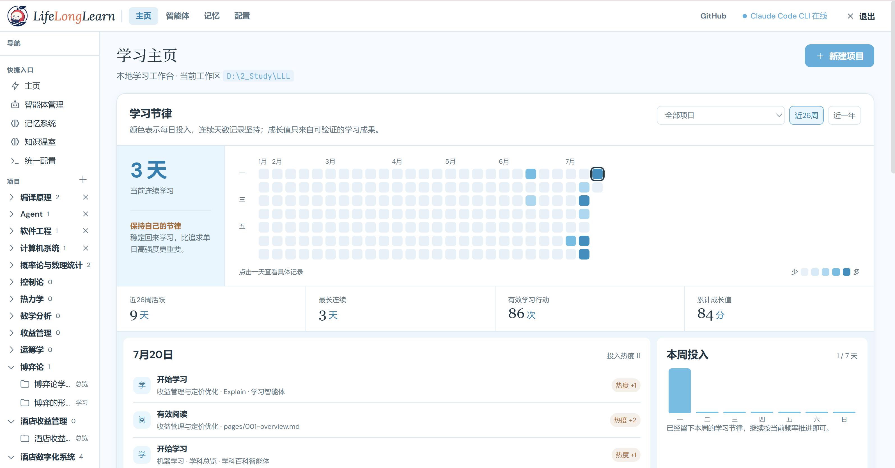
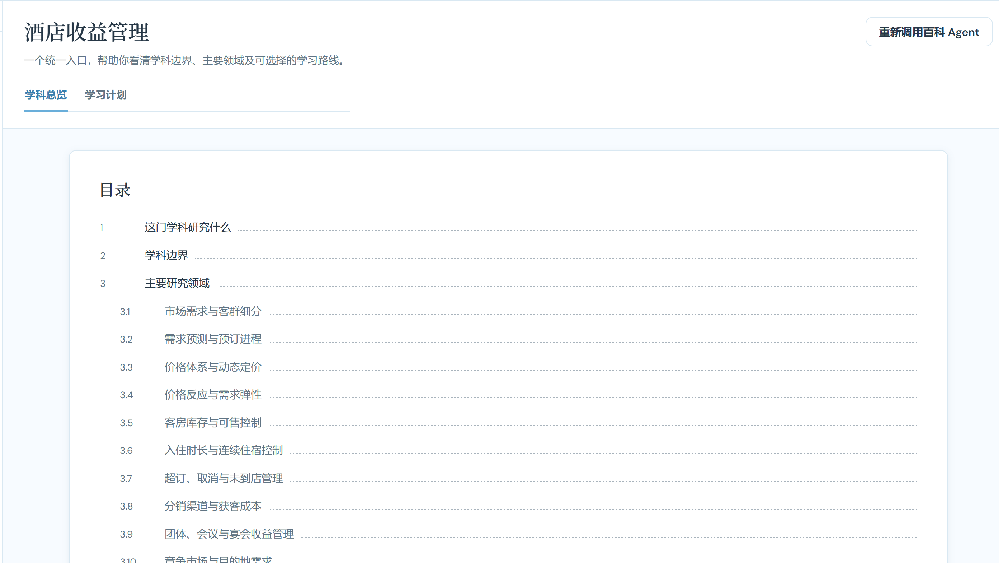
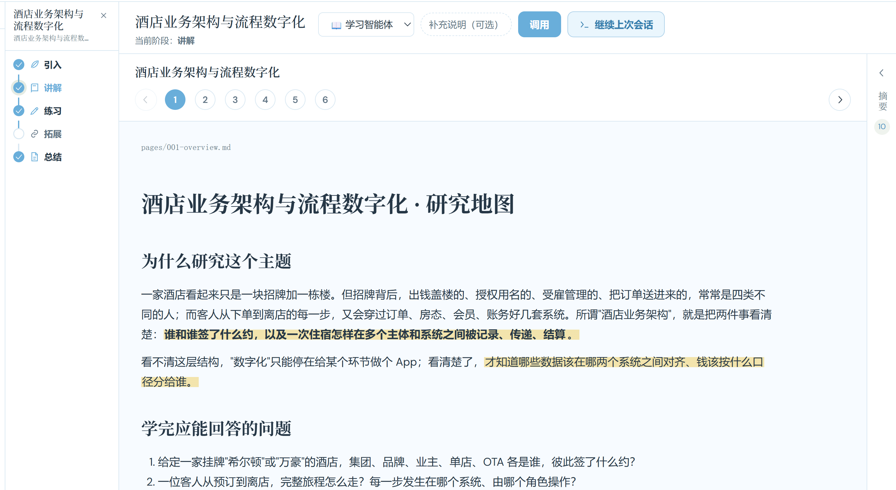

## 产品介绍

LLL（荔枝读书）是一个**本地优先的 AI 学习工作台**：把一个主题变成一份可持久保存、可持续迭代的学习产物，而不是一次性的对话答案。

### 解决的问题

自学时，学习上下文、笔记与复习散落在不同工具里，连续性差；宽泛的学科探索与聚焦的技能深挖被塞进同一种内容形态——需要学科全景时只得到一篇教程，准备深挖时又缺少承诺式的学习流程；通用 AI 对话只给一次性答案，留不下可改进的学习记录。

### 核心方案

- **两种学习形态，由学习者显式选择**：「学科地图」用学科总览与学习计划呈现一门学科的全景、章节架构和可选学习路线；「系统学习项目」走「介绍 → 讲解 → 练习 → 拓展 → 总结」五区闭环。
- **AI 作为顾问与受控的学习操作者**：Claude Code 原生 Agent 生成并修订讲解、练习与总结，每个 Agent 都通过原生 CLI 显式启动，执行过程可经本地真实会话检视；AI 不替你做产品决策、不静默创建项目。
- **本地优先、扁平存储**：学习上下文与产物落在本地项目文件夹，数据自主、可长期积累。
### 形态一：学科地图

### 形态二：系统学习

### 价值

把一次性对话升级为持久、可改进的学习记录；学习形态由学习者掌握，既支持学科全景探索，也支持聚焦的技能深挖，两者不再混淆。文档与代码冲突时，以可运行的代码和当轮迭代文档为真，不靠 AI 推断兜底。

## Agent 部署（推荐）

把下面这段提示词整段复制给 AI Agent（如 Claude Code），它即可在本地完成 LLL 的安装、构建与运行：

> 请在当前机器上部署并运行 LLL（荔枝读书，本地 AI 学习工作台；Go 后端 + React 前端）。
> 仓库根目录：`D:\2_Study\LLL`（或从 https://github.com/porridgeowefish/LLL_life_long_learn clone）。
> 按以下步骤执行，每完成一步向我报告结果：
>
> 1. 检查环境：已安装 Node.js 与 Go（≥ 1.22）；缺失则先安装对应版本。
> 2. 安装前端依赖：在 `frontend/` 目录执行 `npm install`。
> 3. 构建：在仓库根目录执行 `npm run build`（构建前端到 `frontend/dist/`，并编译后端到 `dist/lll.exe`）。
> 4. 启动：执行 `npm run start`（运行 `dist/lll.exe`，生产模式托管 `frontend/dist/` 并带 SPA fallback）。
> 5. 健康检查：`GET http://localhost:8787/api/health` 应返回 200；通过后在浏览器打开 `http://localhost:8787/`。
> 6. 若端口 `8787` 被占用，先执行 `npm run stop` 清理旧进程，再重新启动。
> 7. 如启动报缺少 `config.local.json`，从 `config.local.example.json` 复制一份再按需填写。
> 8.（可选）`npm run desktop:install` 创建桌面快捷方式；`npm run stop` 停止后台服务。
>
> 全程只做安装、构建、运行、验证，不要修改源码；任何步骤失败请附上完整命令输出再问我。

