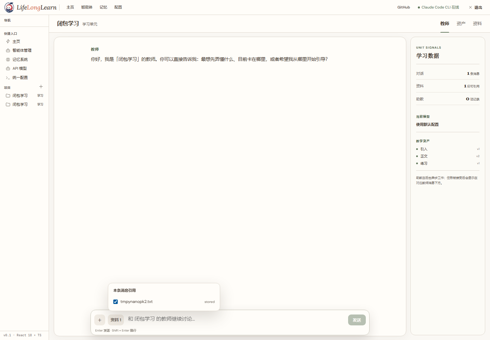

# LLL（荔枝读书）

LLL 是一个**本地优先的教师—助教型 AI 学习工作台**。它不再先生成一套固定教程再让用户阅读，而是让 API 教师持续和学习者对话，并把讨论中形成的理解异步沉淀为可编辑、可追溯的学习资产。



## 当前产品形态

### 教师：同步教学对话

每个对话对应一个学习单元；对话先发生，单元和资产随学习过程逐渐形成。教师默认使用引导、澄清、验证、沉淀、复盘五种柔性教学动作，但学习者可以自然跳转话题，不受固定流程约束。

教师支持流式回复、可折叠的思考摘要、Markdown、LaTeX、Mermaid、安全 SVG 与图片展示。模型与 Provider 可在独立的 API 模型页面统一配置，并能在对话框中随时切换。

### 助教：异步完成重活

当任务涉及资料解析、深入调研、运行实验、生成图表、制作报告或更新教学资产时，教师会先说明任务内容、授权资料、预期产出和学习意义；学习者明确同意后，教师通过工具把任务交给可见的 Agent CLI。

助教在隔离工作区内运行，用户可以在真实终端中查看和手动终止。任务完成后，Go 服务校验清单、路径、哈希和资产基线，再原子提交结果。即使页面刷新、服务重启或终端结果晚到，任务也可以恢复和幂等补提交。

### 资产：学习过程的长期结果

资产不是内部 JSON 或文件路径的展示，而是面向学习者渲染后的内容：

- **引入**：学习动机、范围和入口问题；
- **正文**：讲解、讨论结论、图表和多页材料；
- **练习**：可作答的问题及配套解析；
- **助教成果**：论文精读、实验报告、代码、SVG、图片、网页动画等任意受控交付物。

核心资产可以继续编辑，正文保留选中文本后批注和 Ask AI 的能力。助教成果会自动进入资产视图，不要求用户去任务日志或文件夹中寻找。

### 资料：学习依据与本地知识库

资料可以在教师对话或资料页面上传。原文件、元数据、解析状态和派生内容都保存在项目目录中；需要云端模型解析时会先进行明确授权。资料引用使用稳定 ID，删除、失败和恢复均有文件契约。

### 学科地图：导航而非强约束

学科总览和学习计划仍然用于展示学科边界、章节关系与推荐路线，但不限制一次只能学习一个主题。用户从学科地图进入对话，一个对话逐渐形成一个学习单元。


## 核心原则

- **教师负责教学，助教负责重活**：同步体验与异步生产边界清晰。
- **对话是过程，资产是结果**：资产来自真实学习上下文，不由 Agent 自由发挥。
- **路径即契约，文件即接口**：对话、任务、资料和资产均使用本地可检查的稳定目录结构。
- **显式授权和可见执行**：助教不会静默启动；用户同意后才打开真实 CLI。
- **本地优先、可恢复**：不引入数据库或外部消息队列，重启后从文件恢复状态。

架构与迭代文档见 [docs/00-product-and-architecture](docs/00-product-and-architecture/README.md) 和 [Iteration 13](docs/01-iterations/iteration-13-teacher-assistant-learning-workspace/README.md)。文档与代码冲突时，以可运行代码和当前迭代契约为准。

## 部署

### 前置要求

- Node.js（用于构建前端）
- Go ≥ 1.22（用于后端）
- 至少一个 OpenAI 兼容的 API 模型配置（用于教师与 Ask AI）
- 可选的 Claude Code、Codex CLI 或已接入的 Agent CLI（用于异步助教任务）

### 构建与运行

```bash
cd D:\2_Study\LLL
npm install --prefix frontend   # 首次需安装前端依赖
npm run build                   # 构建前端到 frontend/dist/，并编译后端到 dist/lll.exe
npm run start                   # 运行 dist/lll.exe，生产模式托管 frontend/dist/（含 SPA fallback）
```

浏览器打开 `http://localhost:8787/`；健康检查 `GET http://localhost:8787/api/health` 返回 200 即代表服务正常。

首次运行后，在侧边栏进入 **API 模型**，添加 Provider、Base URL、API Key 和模型名称。教师对话与 Ask AI 共用这套模型配置；搜索引擎配置仍位于统一配置页面。Agent CLI 的账号、模型和密钥由 CLI 自身管理，LLL 只负责运行时选择、上下文封装和可见终端启动。

> 开发时也可用 `npm run run`（即 `go run ./backend-go/cmd/lll`）直接从源码运行后端。

### 桌面快捷方式（Windows）

```bash
npm run desktop:install
```

在桌面创建 `LifeLongLearn` 快捷方式。启动时会：若前端或后端源码比 `dist/lll.exe` / `frontend/dist/index.html` 新，则自动重新构建；随后后台启动 `dist/lll.exe`，等待 `/api/health` 就绪后打开浏览器并退出。若 `8787` 端口被本工作区旧的 LLL 进程占用，会先清理再启动新实例。

### 停止后台服务

```bash
npm run stop
```

也可在前端界面点击 Exit 按钮停止。

## Agent 部署（推荐）

把下面这段提示词整段复制给 AI Agent（如 Claude Code），它即可在本地完成 LLL 的安装、构建与运行：

> 请在当前机器上部署并运行 LLL（荔枝读书，本地 AI 学习工作台；Go 后端 + React 前端）。
> 仓库根目录：`D:\2_Study\LLL`（或从 https://github.com/porridgeowefish/LLL_life_long_learn clone）。
> 按以下步骤执行，每完成一步向我报告结果：
>
> 1. 检查环境：已安装 Node.js 与 Go（≥ 1.22）；如需助教功能，再确认至少一个受支持的 Agent CLI 可用。缺失则先安装对应版本。
> 2. 安装前端依赖：在 `frontend/` 目录执行 `npm install`。
> 3. 构建：在仓库根目录执行 `npm run build`（构建前端到 `frontend/dist/`，并编译后端到 `dist/lll.exe`）。
> 4. 启动：执行 `npm run start`（运行 `dist/lll.exe`，生产模式托管 `frontend/dist/` 并带 SPA fallback）。
> 5. 健康检查：`GET http://localhost:8787/api/health` 应返回 200；通过后在浏览器打开 `http://localhost:8787/`。
> 6. 若端口 `8787` 被占用，先执行 `npm run stop` 清理旧进程，再重新启动。
> 7. 首次进入产品后，在“API 模型”页面添加 OpenAI 兼容 Provider 和模型；不要把真实 API Key 写入仓库或提交到 Git。
> 8.（可选）`npm run desktop:install` 创建桌面快捷方式；`npm run stop` 停止后台服务。
>
> 全程只做安装、构建、运行、验证，不要修改源码；任何步骤失败请附上完整命令输出再问我。


