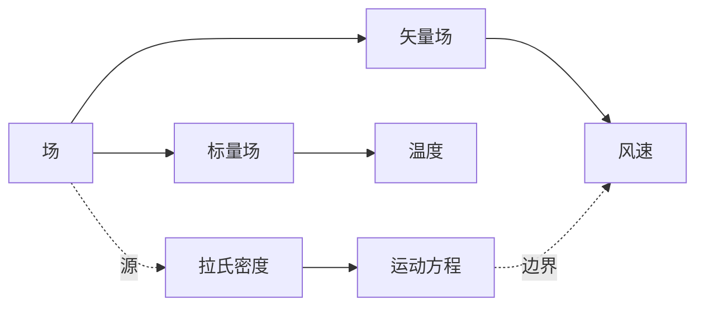

# 概念关系图

## 机制

用 **Mermaid 图**渲染子概念之间的关系，让学习者看到主题的拓扑结构而非列表。拓扑传递散文无法传递的信息：哪些概念在上游、哪些聚类、哪些是叶子。理论基础：概念图教学法 + 概念图可测量改善记忆的研究（Novak & Cañas 2008）。

## 何时使用

- **必选** 讲解智能体的"概念关系图"章节。
- **不要** 当主题子概念少于 4 个——列表更清晰。
- **不要** 当关系纯线性——改用编号链。
- **不要** 当主题本身就是图算法——元图会让人糊涂。

## 输出形态

- **章节小标题**：`## 概念关系图`
- 一个 Mermaid `graph` 块，**节点 ≤ 12**（可读性悬崖）
- 每个节点标签是短名词短语（≤ 4 个汉字或 ≤ 3 个英文单词）
- 有向边（`-->`）用于因果或组合关系；无向（`---`）用于相似或共现
- 图下方一段短文点出 2-3 条**承重边**及其原因
- 总长：图 + 约 100 字解说

## 反模式

- **大杂烩图**：20+ 节点——学习者放弃——折叠或拆分
- **混合关系语义**：所有边画一样——无法区分因果与相似——一致使用边类型
- **无解说**：图只对作者说话——总要指出承重边

## 强制约束

- **全中文**：图节点标签中文优先。**禁止** "Concept Graph / Concept Relationships"。
- **禁止元对话**：直接给图 + 解说，不要"以下关系图展示了..."。

## 示例

```markdown
## 概念关系图



承重边是 `A → B/C`（组织其余主题的类型分裂）和 `F → G`（从拉氏量到运动的变分路径）。虚线不是推导，是交叉引用。
```

7 节点、3 种关系类型、解说指向主轴。
