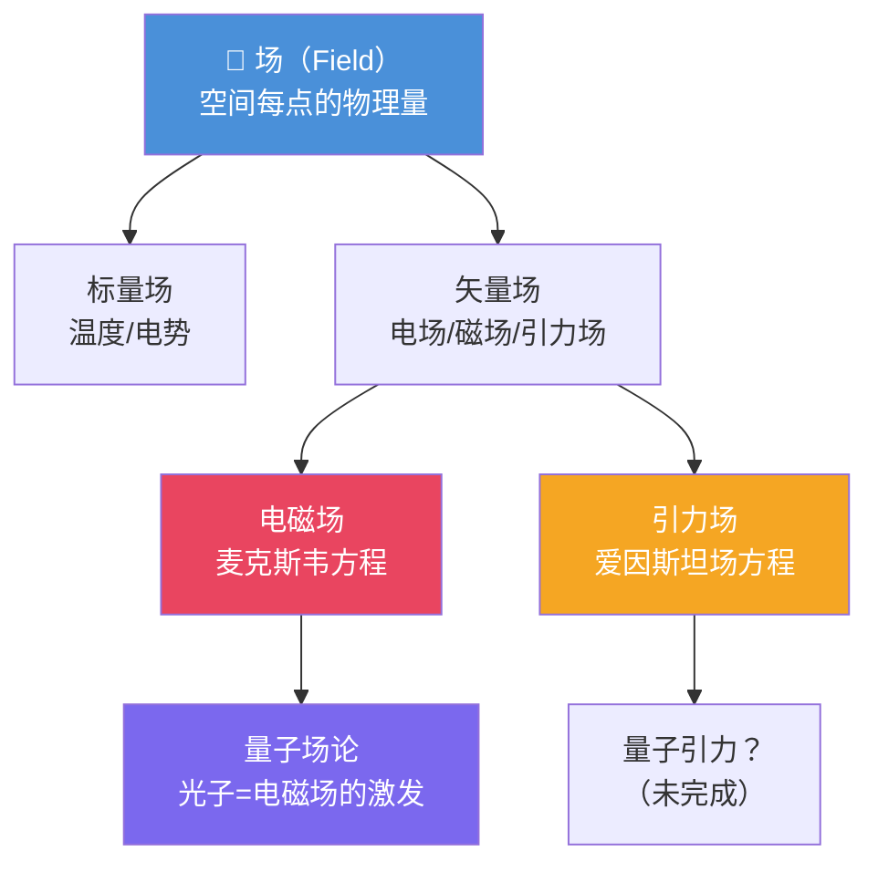

# 场论（Field Theory）学习笔记

> 学习者定位：完全陌生 | 目标：能跟人聊 | 背景：计算机 + 牛顿物理
> 生成日期：2025-06-05 | 来源：早期 deepthink 工作流产出（保留作历史金标准；后续重生成由 explain agent + reasoning primitives 产出，对照见 docs/00-product-and-architecture/AGENT_PRIMITIVES.md）

---

## 可执行摘要

**一句话**：场论用"场"（每个空间点都有值的数学对象）取代了"超距作用"，是现代物理描述力、光、物质的语言。

**三个核心收获**：
1. **场是什么**：空间中每一点都带一个值（温度）或一个箭头（风速）→ 这就是一个场
2. **为什么需要场**：牛顿力学无法解释"力怎么隔着真空传递"，场填上了这个窟窿
3. **场论的格局**：经典场论（电磁场）→ 相对论场论（引力场）→ 量子场论（粒子也是场）

**五分钟聊天话术**：牛顿说物体之间有万有引力，但没说引力怎么传过去——法拉第和麦克斯韦提出电磁场，爱因斯坦用引力场替代"超距力"，最后量子场论把粒子本身也变成了场的激发态。

---

## Step 1：核心界定——场论为什么存在？

### 源起与目的

| 维度 | 内容 |
|------|------|
| **诞生背景** | 牛顿力学留下一个悬而未决的问题：太阳和地球隔着一亿多公里，引力是怎么传过去的？牛顿自己说"我对此不加假说"（hypotheses non fingo） |
| **解决的核心问题** | 用"场"作为中间媒介，解释力如何在空间中传递，不再需要"超距作用" |
| **本质价值** | 把"物体A直接作用于物体B"的图景，变成"物体A → 产生场 → 场在空间传播 → 作用于物体B" |
| **前置假设** | 空间不是空的，每一点都可以承载物理量；物理规律用连续数学（微积分）描述 |

### 核心概念表

| 概念 | 一句话定义 | 类比（CS） |
|------|-----------|-----------|
| **场（Field）** | 空间中每一点都有一个物理量的映射 | 无限大的 HashMap，key 是坐标 `(x,y,z,t)` |
| **标量场** | 每个点一个数值（没有方向） | 2D float 数组，存温度/气压 |
| **矢量场** | 每个点一个箭头（大小+方向） | 流体模拟中的速度场 |
| **场方程** | 描述场如何产生、如何变化的方程 | 系统的 API 规范 |
| **场量子** | 场的能量最小激发单元 | 事件队列中不可再分的一条消息 |

> 🤔 **检查点**：你能用一句话回答"场论解决的核心问题"吗？→ "解释力如何在空间中传递，消除了超距作用。"

---

## Step 2：本质拆解——底层逻辑 + 直觉理解

### 2.1 底层逻辑（第一性原理风格）

**原点**：牛顿力学的"幽灵"——超距作用

```
牛顿力学图景：
  太阳 ────────引力？怎么传的？──────── 地球

场论图景：
  太阳 ──产生──→ 引力场 ──传播──→ 作用于地球
         （弯曲时空）   （以光速传播）
```

**推导链**：
1. **观察**：力可以隔空作用（磁铁、引力、静电）
2. **问题**：中间是什么在传力？→ 引入"场"作为媒介
3. **场的数学**：给空间每个点赋予一个值 → 需要多元函数 → 需要微积分
4. **场的动力学**：场不是静止的，会传播、会变化 → 需要偏微分方程
5. **场方程**：麦克斯韦方程组（电磁）、爱因斯坦场方程（引力）
6. **场的量子化**：场也能一份一份地传递能量 → 光子、引力子

### 2.2 直观理解（类比法——CS 背景）

#### 类比 1：场 = 分布式数据结构

```
温度标量场（类比 2D 数组）：

  温度传感器网格（每格一个温度值）
  ┌────┬────┬────┬────┐
  │ 22 │ 23 │ 25 │ 28 │  ← 越靠右越热
  ├────┼────┼────┼────┤
  │ 21 │ 22 │ 24 │ 26 │
  ├────┼────┼────┼────┤
  │ 20 │ 21 │ 22 │ 23 │
  └────┴────┴────┴────┘
  这就是一个标量场 T(x, y)
```

```
风速矢量场（类比向量场）：

  每个点上有一个箭头 →
  ·→  ·→  ·↗  ·↑
  ·→  ·→  ·→  ·↗
  ·↗  ·→  ·→  ·→
  这就是一个矢量场 v(x, y)
```

**映射关系**：
| 物理概念 | CS 类比 |
|---------|---------|
| 场 | `f(x, y, z, t)` — 连续函数 / 无限维 HashMap |
| 标量场 | `float field[∞][∞][∞]` — 温度分布 |
| 矢量场 | `Vector3 field[∞][∞][∞]` — 风速分布 |
| 场方程 | API specification — 规定了场的行为 |
| 场的传播 | 网络延迟 — 信号从 A 传到 B 需要时间 |
| 量子化 | 事件驱动 — 能量不是连续的，是离散事件 |

**类比失效处**：
- CS 中的 HashMap 是离散的，物理场是连续的
- 网络有延迟但可以丢包，场的传播不丢"能量"
- 量子场的"叠加"在经典 CS 中没有好类比（量子计算才有）

#### 类比 2：电磁场 = "看不见的介质"

想象你往水池里丢一块石头：
- 石头 → 扰动水面 → 水波向外传播 → 远处的树叶跟着晃

对应到电磁：
- 电荷 → 扰动电磁场 → 电磁波向外传播 → 远处的天线接收到信号

**水波是水的振动，电磁波是场的振动。**

### 2.3 概念关系图



---

## Step 3：MECE 知识图谱

```
场论知识体系（MECE 结构）
│
├── 1. 场的概念基础
│   ├── 1.1 标量场：每点一个数（温度 T(x,y,z)）
│   ├── 1.2 矢量场：每点一个箭头（电场 E(x,y,z)）
│   ├── 1.3 张量场：每点一个矩阵（引力场 g_μν）
│   └── 1.4 场的数学工具：梯度、散度、旋度
│
├── 2. 经典场论 ⭐（80/20 关键驱动）
│   ├── 2.1 电磁场
│   │   ├── 电场（库仑力 → 场）
│   │   ├── 磁场（磁力 → 场）
│   │   └── 麦克斯韦方程组（统一电+磁）
│   ├── 2.2 引力场
│   │   ├── 牛顿引力（超距力 → 初步场化）
│   │   └── 广义相对论（引力 = 时空弯曲）
│   └── 2.3 场的能量与动量（场本身携带能量）
│
├── 3. 量子场论（进阶，了解即可）
│   ├── 3.1 场的量子化：场 → 粒子
│   ├── 3.2 标准模型：17种基本粒子 = 场的激发
│   └── 3.3 费曼图：粒子相互作用的图形化
│
└── 4. 场论的应用与延伸
    ├── 4.1 电磁波 → 无线通信
    ├── 4.2 激光 → 受激辐射（量子场效应）
    ├── 4.3 引力波 → 2015年首次探测
    └── 4.4 希格斯场 → 粒子质量的来源

⭐ 关键驱动因素（80/20）：
  - 2.1 电磁场（麦克斯韦方程）→ 理解场论的核心入口
  - 2.2 引力场 → 从牛顿到爱因斯坦的认知跃迁
```

> 🤔 **检查点**：闭上眼，你能回忆起 MECE 的 4 个一级维度吗？→ 场的概念基础、经典场论、量子场论、应用延伸。

---

## Step 4：批判性收尾

### 边界与局限

| 局限 | 说明 |
|------|------|
| 经典场论不适用于微观 | 电子在原子中的行为需要量子场论 |
| 量子场论和广义相对论不兼容 | 引力的量子化至今未解决（弦论/圈量子引力是候选） |
| 场论不描述意识 | 物理场是物质层面的，不涉及主观体验 |
| 计算复杂度 | 多体场方程通常没有解析解，需要数值模拟 |

### 常见误区

> ❌ **误区 1**："场只是数学工具，不是真实存在"
> ✅ 场携带能量和动量，可以被探测。电磁波（光）就是电磁场的传播——你能说光不是真实存在的吗？

> ❌ **误区 2**："场和力是一回事"
> ✅ 力是场对物体的作用效果。场是原因，力是结果。好比 API（场）和 API 调用的返回值（力）。

> ❌ **误区 3**："量子场论太难，和经典场论无关"
> ✅ 量子场论是经典场论的量子化版本，基础框架完全延续。先搞懂经典再进量子，路径是通的。

### 深度追问

1. **如果场以有限速度传播，那引力传播需要时间——如果太阳突然消失，地球要多久才能感知到？**
   → 约 8.3 分钟（光速传播），地球会在 8 分钟后沿直线飞出轨道。

2. **电磁场可以统一（麦克斯韦），那引力场和电磁场能进一步统一吗？**
   → 爱因斯坦后半生都在做这件事（统一场论），至今未成功。弦理论是一个候选方向。

### 认知连接（与你已有知识的关联）

| 已有知识 | 连接到场论 |
|---------|-----------|
| 牛顿第二定律 F=ma | 场论说 F 不是凭空来的，F = qE（电场力）或 F = mg（引力） |
| 牛顿万有引力 | 引力场的牛顿近似，广义相对论是精确版 |
| 计算机中的函数 | 场 = 空间坐标到物理量的函数映射 |
| 分布式系统 | 场的传播延迟 ≈ 网络传播延迟，不能超光速 ≈ 因果律 |
| 像素网格 | 标量场 ≈ 像素值网格（连续化版本） |

### 知识迁移

**跨域迁移 1**：场论思维 → 经济地理
- "经济场"：每个地理坐标都有经济属性（GDP密度、人口密度），经济活动沿梯度流动，类似粒子沿场的梯度运动。

**跨域迁移 2**：场论思维 → 机器学习
- 损失函数景观（loss landscape）就是一个标量场
- 梯度下降 = 沿场的梯度方向"滚落"
- Hessian 矩阵 = 场的曲率信息

**反事实推演**：如果场传播速度是无限的（超距作用成立）会怎样？
→ 因果律崩溃：你可以看到"未来"发生的事（因为信息可以瞬间到达）；相对论不成立（光速不再是上限）；整个现代物理框架坍塌。**场的有限传播速度是因果律的物理基础。**

---
